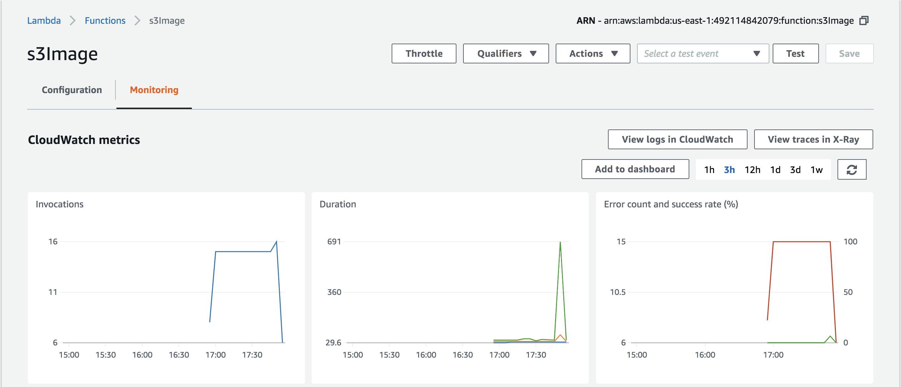

# Lab 32: Lambda Warmers

## Overview
Previous lab Lambda method was used.

## Feature Tasks
1. Lambda to create thumbnail versions of images should never be cold. CloudWatch timer was used create a rule Schedule to invoke Target to help keep it alive. Screenshot of cloud monitoring is below.

